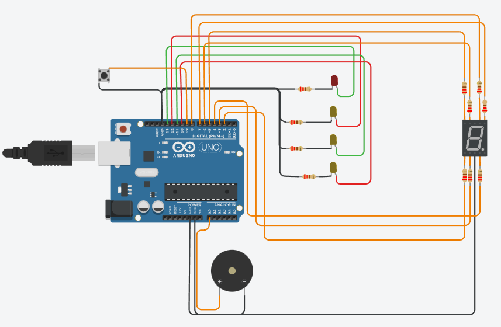

# Proyecto grupal Dojos 2 SPD 

## Integrantes 
 
 * Flores Brandon
 * Corimayo Alan
 * Falanga Alejandro
 * Fleitas Ezequiel
 * Yapura Franco

## Proyecto: Estación de subte



### Descripción

Implementa un sistema que le permite al usuario saber a qué estación de subte está llegando, aparte  el sistema muestra las estaciones que faltan hasta llegar a destino.

### Función principal

Cuando se presione el boton se iniciara el programa sino no hara nada.Con la función led_display_2 elijo que luces prender y que no empezando desde la estación de subte(Constitución) haciendo que el display 7 segmentos muestra el numero de estaciones que faltan para llegar el destino(Moreno),suena el buzzer cada que llega a una estación y cambia el numero de estaciones faltantes del display y asi y luego hace la vuelta de moreno a constitución. 

### Codigo 


```c++

void loop()
{
  int estadoP1 = digitalRead(pulsador);
  Serial.println(estadoP1);
  if(estadoP1 == LOW)//Cuando se pulse el boton arranca el programa.
  {
    while(true)
    {
      luz_display_2(10,11,12,13,3,1000,500);
      luz_display_2(10,11,13,12,2,100,50);
      luz_display_2(10,13,12,11,1,500,50);
      luz_display_2(12,11,13,10,0,250,100);
      luz_display_2(10,13,12,11,1,500,50);
      luz_display_2(10,11,13,12,2,100,50);
    }
  }
}

void luz_display_2(int led,int led2,int led3,int led4,int opcion,int frecuencia,int longitud)
{
  for(int i=0;i<5;i++)
  {
    digitalWrite(led, LOW);
   	digitalWrite(led2, LOW);
    digitalWrite(led3, LOW);
    digitalWrite(led4, HIGH);
    display_5_segmentos(opcion);
    tone(A0,frecuencia,longitud);
    delay(1000);
  }
}
void display_5_segmentos(int opcion)
{
  digitalWrite(8, LOW);
  digitalWrite(7, LOW);
  digitalWrite(4, LOW);
  digitalWrite(3, LOW);
  digitalWrite(2, LOW);
  digitalWrite(6, LOW);
  digitalWrite(5, LOW);
  
  if(opcion == 3)//numero3
  {
   	digitalWrite(8, HIGH);
    digitalWrite(7, HIGH);
    digitalWrite(4, HIGH);
    digitalWrite(3, HIGH);
    digitalWrite(5, HIGH);
  }
  else if(opcion == 2)//numero 2
  {
    digitalWrite(8, HIGH);
    digitalWrite(7, HIGH);
    digitalWrite(2, HIGH);
    digitalWrite(3, HIGH);
    digitalWrite(5, HIGH);
  }
  else if(opcion == 0)//numero 0
  {
    digitalWrite(6, HIGH);
    digitalWrite(4, HIGH);
    digitalWrite(7, HIGH);
    digitalWrite(8, HIGH);
    digitalWrite(2, HIGH);
    digitalWrite(3, HIGH);
    
  }
  else//numero 1
  {
    digitalWrite(7, HIGH);
    digitalWrite(4, HIGH);
  }
}

```

## Link al proyecto 

[tinkercard.com](https://www.tinkercad.com/things/hHzRIlv3VYD "Link al arduino")

### Fuentes 

[Consigna](https://docs.google.com/document/d/1QUrNz4aSNclbVyzF3rY5Ou-MX76enlGj5Y95jY3h6KY/edit (Classroom))

[Tutorial de git](https://www.youtube.com/watch?v=oxaH9CFpeEE)

[Ejemplo de git](https://github.com/Estebamq/EjemploDocumentacion)

[Ayuda para el código del piezo](https://www.youtube.com/watch?v=xBLYrbYIxLA)

[Ayuda para el código del boton](https://www.youtube.com/watch?v=GOto2dPfBtw)

[Ayuda para el código del boton 2](https://www.youtube.com/watch?v=mIhkmMHG84w)

[Ayuda para el código del boton 3](https://www.youtube.com/watch?v=IzzfvAxXyjY)
